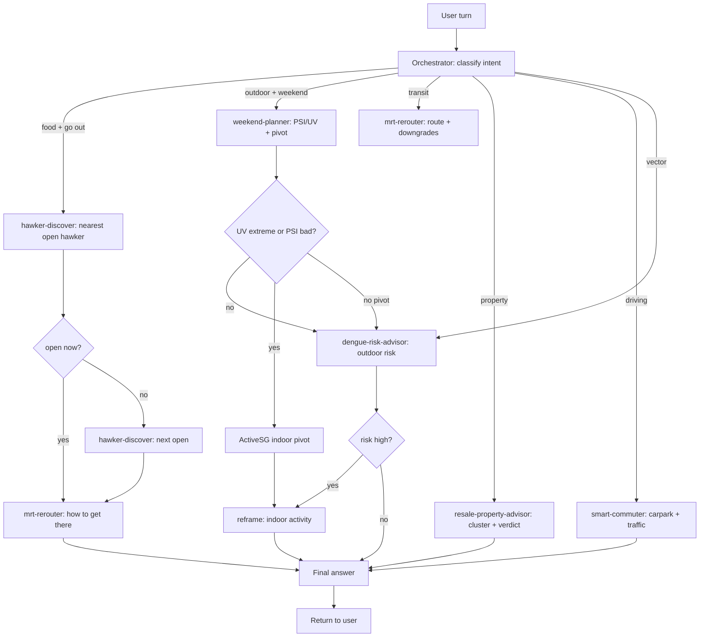

# Orchestration Guide

How to chain the six core `singapore-skills` into a single user turn. This
guide is for the agent runtime — not for end users. Each skill is
self-contained; orchestration is the glue that decides *which* skills to
call, *in what order*, and *with what intermediate state*.

> **Parent:** see [`../README.md`](../README.md) for the full skill list
> and per-skill docs. The six skills covered here are:
> [`smart-commuter-skill`](../smart-commuter-skill/),
> [`resale-property-advisor-skill`](../resale-property-advisor-skill/),
> [`weekend-planner-skill`](../weekend-planner-skill/),
> [`mrt-rerouter-skill`](../mrt-rerouter-skill/),
> [`dengue-risk-advisor-skill`](../dengue-risk-advisor-skill/),
> [`hawker-discover-skill`](../hawker-discover-skill/).
> Plus the existing
> [`cdc-voucher-locator-skill`](../cdc-voucher-locator-skill/).

---

## 1. The chained-tool pattern

A "chain" is **two or more skills run in sequence where the output of
skill N is an input to skill N+1**. Not parallel — sequential. The
pattern is:

```
user turn → orchestrator (you) → skill₁ → check₁ → skill₂ → check₂ → … → answer
```

The orchestrator decides:

1. **Which skills to chain.** A trigger-words table (see §4) maps the
   user's intent to a 1-3 skill sequence.
2. **The order.** Skills are run "outside-in" — the user's primary
   concern first (e.g. *where to eat*), environment conditions next
   (e.g. *is it safe to go out*), and infrastructure last (e.g. *how to
   get there*).
3. **What to pass forward.** Each skill returns a JSON envelope. The
   orchestrator extracts specific fields (e.g. `recommendation.lat`,
   `recommendation.lon`) and feeds them as flags or arguments to the
   next skill.
4. **When to short-circuit.** A "low UV" result from the dengue advisor
   means the weekend planner doesn't need to pivot. A "voucher-mode-C"
   error from hawker-discover means we don't try to query voucher
   acceptance at the suggested hawker.

There is no "orchestration engine". The orchestrator is the LLM reading
this doc.

---

## 2. Flow diagram



The boxes with white backgrounds are the six skills. The diamond
shapes are orchestrator-side decisions. The grey boxes are
reframed answers (still produced by the orchestrator, not by a
skill).

---

## 3. Caching convention

All skills share the same cache root: `~/.hermes/cache/<namespace>/<sha1>.json`.
The `<namespace>` is owned by each skill. The v2 dataset flow uses two
namespace patterns:
- `dataset:<DATASET_ID>` (CSV) or `dataset:<DATASET_ID>:<filter-hash>` (CSV with filters)
- `dataset-geojson:<DATASET_ID>` (GeoJSON)

DATASET_IDs are defined in `singapore_api.py` (e.g. `HDB_RESALE_DATASET_ID`).

| Skill | Namespace(s) |
|-------|--------------|
| `smart-commuter-skill` | `lta_traffic_images`, `hdb_carpark_availability`, `nea_two_hour_forecast`, `onemap_search` |
| `resale-property-advisor-skill` | `dataset:d_8b84c4ee58e3cfc0ece0d773c8ca6abc` (HDB Resale), `dataset-geojson:d_90d86daa5bfaa371668b84fa5f01424f` (URA), `dataset:d_b16d06b83473fdfcc92ed9d37b66ba58:<hash>` (NEA Rainfall with filter) |
| `weekend-planner-skill` | `psi`, `uv`, `dataset:d_bda4baa634dd1cc7a6c7cad5f19e2d68` (hawker closures), `dataset-geojson:d_9b87bab59d036a60fad2a91530e10773` (SportSG), `nea_two_hour_forecast`, `onemap_search` |
| `mrt-rerouter-skill` | `lta_mrt_arrival`, `lta_bus_arrival`, `lta_traffic_images`, `psi`, `nea_two_hour_forecast` |
| `dengue-risk-advisor-skill` | `dataset-geojson:d_dbfabf16158d1b0e1c420627c0819168` (dengue clusters), `dataset:d_b16d06b83473fdfcc92ed9d37b66ba58:<hash>` (NEA rainfall), `four_day_forecast`, `psi` |
| `hawker-discover-skill` | `dataset:d_bda4baa634dd1cc7a6c7cad5f19e2d68` (hawker closures), `dataset-geojson:d_4a086da0a5553be1d89383cd90d07ecd` (hawker centres), `onemap_search` (via CDC subprocess) |
| `cdc-voucher-locator-skill` | `cdc_vouchers`, `onemap_search` |

The orchestrator does **not** pre-warm the cache. Skills populate it on
demand. Real-time data (PSI, UV, LTA arrival) TTLs naturally because
the skill script's `request_json` helper writes a fresh file each call
and the SHA1 includes the URL + query params — so changing inputs
yields a different cache key.

Stale data is **never** the orchestrator's responsibility. If the
user says "check again", the orchestrator re-runs the skill; the
script writes a new cache file with the new timestamp.

---

## 4. Trigger-words table

Match the user's intent to the *first* skill in the chain. Subsequent
skills are determined by the flowchart in §2.

| User query shape | First skill | Why |
|------------------|-------------|-----|
| "Where can I park near X" / "carpark at X" | `smart-commuter-skill` | Driving context, traffic-aware |
| "Is X a fair price for an HDB" / "should I buy a flat in X" | `resale-property-advisor-skill` | Property domain |
| "Plan my Saturday" / "should I go to the park tomorrow" / "is X a good day for Y" | `weekend-planner-skill` | Outdoor, weekend, weather-conditioned |
| "How do I get from X to Y" / "MRT to X" / "bus to X" | `mrt-rerouter-skill` | Transit domain |
| "Is it safe to jog in X" / "dengue in X" / "mosquitoes at X" | `dengue-risk-advisor-skill` | Vector-borne risk |
| "Hawker near X" / "what can I use my CDC voucher on" / "where to eat at X" | `hawker-discover-skill` | Food + voucher |
| Anything else (default) | The most specific noun → match the closest row | Falls back to the most-relevant single-skill run |

These are heuristics, not regex. The orchestrator should err toward
**fewer skills**, not more. If a single skill fully answers the
question, run only that skill. Chains are for compound intents
("plan my Saturday" = outdoor + transit + mosquito risk).

---

## 5. Worked example: "Plan my Saturday"

User: *"Plan my Saturday afternoon in Bishan, want to go cycling and
grab dinner."*

**Step 1 — classify the intent.** "Plan my Saturday" + "outdoor
activity" + "dinner" → weekend-planner first, then dengue (outdoor
risk), then mrt-rerouter (how to get back if it rains).

**Step 2 — run `weekend-planner-skill`.**

```bash
python3 weekend-planner-skill/scripts/weekend_planner.py \
  --location "Bishan Park" --activity "cycling" --time 16:00
```

Output (abridged):

```json
{
  "location": "Bishan Park",
  "psi": {"tier": "good", "national": 28},
  "uv": {"tier": "high", "value": 7},
  "weather": {"forecast": "Partly Cloudy", "heavy_rain": false},
  "hawker_closures": [],
  "alternates": [],
  "recommendation": "Outdoor activity is fine (UV 7 = high — wear sunscreen). No hawker closure near Bishan Park."
}
```

**Step 3 — check: do we need the dengue advisor?** The weekend-planner
said `psi: good` and `uv: high (not extreme)`. Per the flowchart,
non-extreme UV + good PSI → run dengue-risk-advisor as a sanity check.

```bash
python3 dengue-risk-advisor-skill/scripts/dengue_risk_advisor.py \
  --town BISHAN --activity "cycling" --date 2026-06-27
```

Output:

```json
{
  "dengue_clusters_nearby": 1,
  "rainfall_forecast_mm_7d": 28.4,
  "rainfall_history_avg_mm_7d": 36.1,
  "risk_score": 1,
  "risk_tier": "moderate",
  "recommendation": "1 cluster within 1km; rainfall below average. Apply repellent, then proceed."
}
```

**Step 4 — check: do we need the mrt-rerouter?** Only if the user
subsequently asks "how do I get home from Bishan after dinner". At
that point, run:

```bash
python3 mrt-rerouter-skill/scripts/mrt_rerouter.py \
  --origin "Bishan Park" --destination "Woodlands"
```

The `mrt-rerouter` returns ranked routes with PSI/weather downgrades
already applied.

**Step 5 — assemble the answer.** Synthesise the three reports into
a single user-facing paragraph. Do not dump raw JSON. Always restate
the location, the conditions, and the concrete next action.

> "Saturday 4pm in Bishan looks fine for cycling — PSI 28 (good), UV 7
> (high, wear sunscreen), no rain forecast. 1 dengue cluster within
> 1 km of Bishan Park; apply repellent. For dinner, Tiong Bahru
> Market is open and ~10 min by MRT from Bishan. To get home after
> dinner, take the NS line (the walk from Bishan MRT to your
> destination is 400 m, no penalty at this PSI)."

---

## 6. Do NOT orchestrate

Some queries *look* chainable but are not. Match the closest single
skill and answer, or ask for clarification.

### 6.1. "What's the price of resale flats in Bishan?"

This is **only** `resale-property-advisor-skill`. Do not chain
`weekend-planner` afterwards — the user is shopping, not planning an
outing. Chaining adds noise.

```bash
python3 resale-property-advisor-skill/scripts/resale_property_advisor.py \
  --town BISHAN --flat-type "4 ROOM" --since 2024-01 --asking 600000
```

### 6.2. "Where can I park at VivoCity?"

This is **only** `smart-commuter-skill`. Do not chain
`dengue-risk-advisor` — the user is driving, not planning to be
outdoors for long.

```bash
python3 smart-commuter-skill/scripts/smart_commuter.py \
  "VivoCity"
```

### 6.3. "Should I jog at MacRitchie tomorrow morning?"

This is **only** `dengue-risk-advisor-skill`. Even though it sounds
like a weekend-planner query, the user's specific concern is vector
risk, not weather. The dengue advisor's `psi` and rainfall fields
are sufficient context. Chaining weekend-planner would duplicate the
PSI read.

```bash
python3 dengue-risk-advisor-skill/scripts/dengue_risk_advisor.py \
  --town MACRITCHIE --activity "jogging" --date 2026-06-27
```

### 6.4. "What hawker centres are open in Toa Payoh right now?"

This is **only** `hawker-discover-skill`. The user's question is
narrowly about *open* hawkers. Chaining weekend-planner would add
UV/PSI noise. Chaining dengue would add mosquito noise. Run the
single skill:

```bash
python3 hawker-discover-skill/scripts/hawker_discover.py \
  "Toa Payoh Hub" A 1000
```

The rule of thumb: **if the user's question is "should I" → chain;
if the question is "what is" or "where is" → run the single skill.**

---

## 7. Failure handling

If a skill exits non-zero or returns an error envelope:

1. Surface the error to the user in plain English.
2. Do **not** retry the chain from the top. Re-run only the failed
   skill with the same arguments. Most errors are deterministic (e.g.
   v1 rate-limit, geocode miss).
3. If a transitive skill fails (e.g. `mrt-rerouter` after
   `hawker-discover`), drop the transit leg and give the user what
   the first skill returned. The user can re-ask for directions.

---

## 8. Adding a new skill to the chain

When you add a 7th or 8th skill:

1. **Update §4** — add a row to the trigger-words table.
2. **Update §2** — add the new node to the mermaid diagram.
3. **Update §3** — list the new namespace(s) in the caching table.
4. **Add a worked example in §5 OR a negative example in §6.** Pick
   the one that matches the new skill's *primary* use case.
5. **Bump this guide's revision date** at the bottom.

Do not skip steps 4 and 5. The worked / negative examples are how
orchestrators (LLMs reading this) actually learn the boundary of
each skill.

---

*Revision 2026-06-21 — covers all 6 cores. Next revision should
add the cross-reference back to the parent README's "Skills in
this repo" table once a 7th skill ships.*
